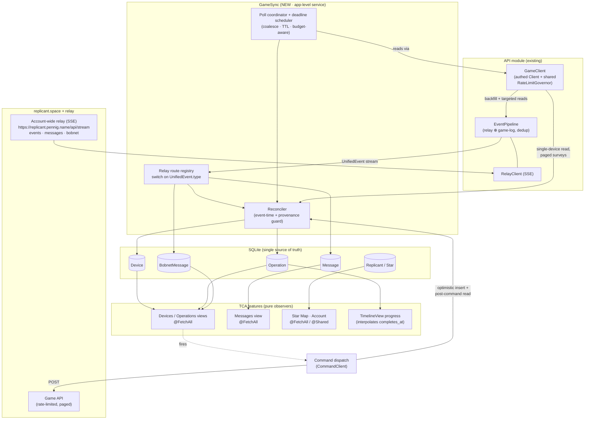
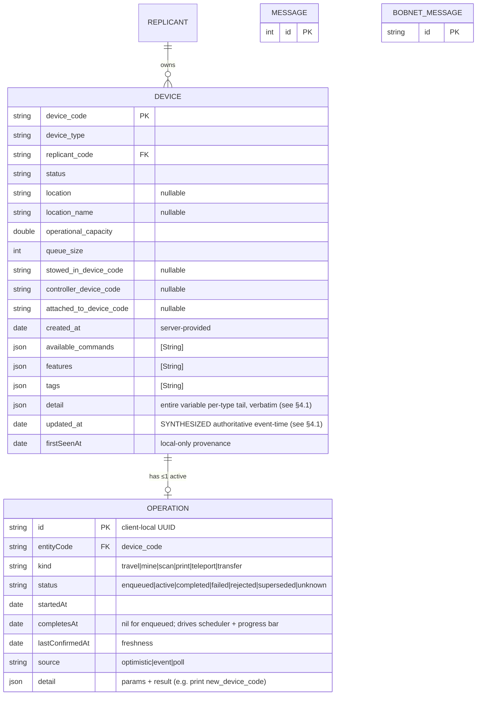
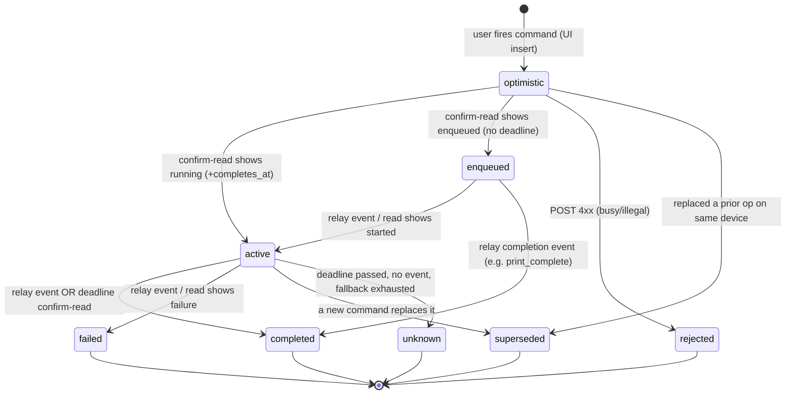
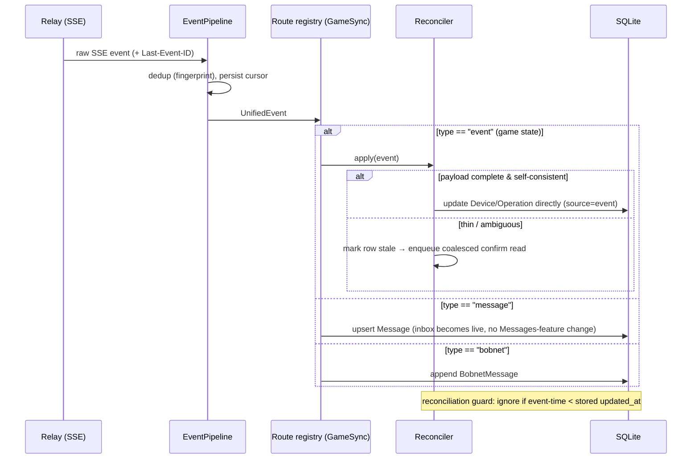
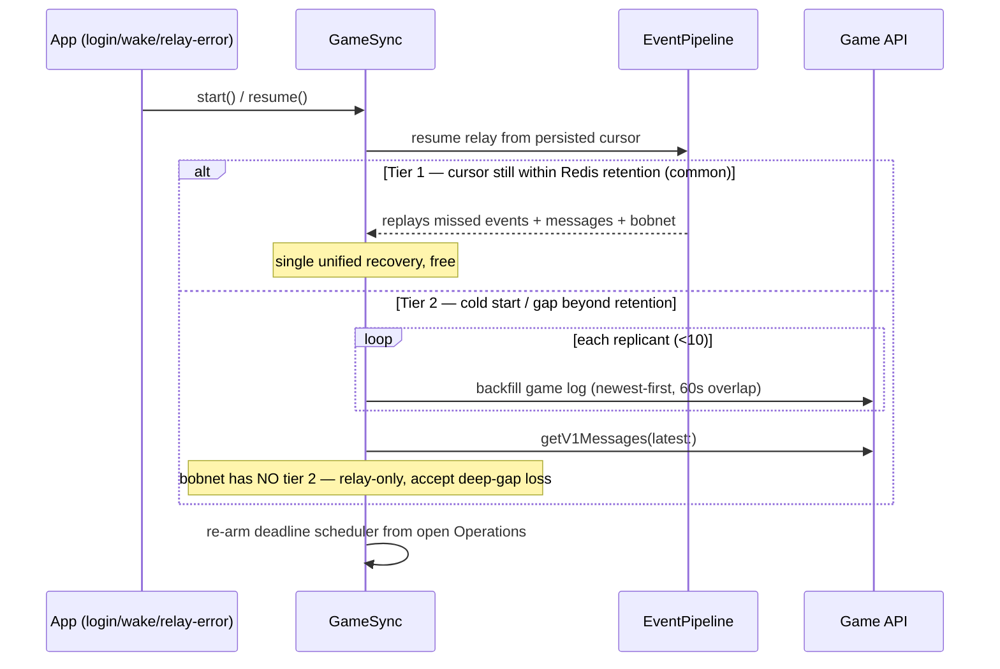
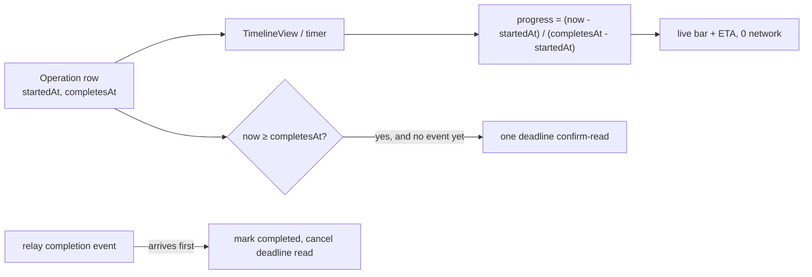

# Implementation Plan — Real-Time State & Long-Running Actions

_Companion to `ARCHITECTURE_REVIEW.md`. That document is the **why**; this is the **what/how/in-what-order**. Where the review weighs options, this plan commits to one and breaks it into shippable phases I can follow._

_Status: proposal, awaiting go-ahead. Date: 2026-06-25._

---

## 1. Goal & non-goals

**Goal.** Drive long-running server actions and reflect their progress across every screen in best-effort real time, while spending the rate budget at a small constant per action instead of polling. Concretely:

- Issue a command to a device, see it confirmed and progressing within one round-trip.
- Watch progress to completion with **zero** reads in between for self-describing actions; with a single relay event for enqueued ones.
- Keep a hundreds-to-1000+ device fleet fresh off the **account-wide relay**, not polling.
- Make every screen showing an entity consistent automatically, because they all observe the same SQLite rows.

**Non-goals (this plan).** Building out every command's UI; the Bobnet feature beyond a minimal store; multi-account/multi-user (the relay is single-tenant today); replacing the existing cold-load surveys (Stars, Messages head-page) — those stay and are kept warm by this system.

**Settled decisions carried in from the review** (not re-litigated here): SQLite-as-truth + thin reducers; one app-level ingestion service; `Operation` as a first-class table; one active operation per device; correlate by `entityCode` (no server id); reconcile by event-time with provenance; one authoritative single-device read after every successful command; surface the rate budget.

---

## 2. Target architecture at a glance

One long-lived **`GameSync`** service is the sole consumer of the account-wide relay and the only writer that ingests external change. Features stay pure observers of SQLite. Three writers (optimistic dispatch, relay events, targeted reads) converge on the same rows through one reconciliation function.



Key reading of the diagram: **everything external flows into `RECON` or `ROUTER` and lands in SQLite; everything in the UI flows out of SQLite.** There is exactly one path in and one path out, which is what keeps N screens faithful for free.

---

## 3. Module & dependency changes

Preserve the existing acyclic graph. New code goes in the lowest layer that all consumers share, and feature-specific behavior is **registered from the app target** (mirroring how `ReplicantApp.registerSessionCleanup()` wires feature cleanup without `AccountManager` knowing about feature tables).

```mermaid
flowchart BT
    Utils --> API
    API --> DependencyClients
    DependencyClients --> GameSync
    API --> GameSync
    DependencyClients --> AccountManager
    API --> AccountManager
    UI --> DevicesFeature
    DependencyClients --> DevicesFeature
    GameSync --> DevicesFeature
    DependencyClients --> MessagesFeature
    GameSync -. routes registered by .-> App["macOS app target"]
    DevicesFeature --> App
    MessagesFeature --> App
    AccountManager --> App
    GameSync --> App

    classDef new fill:#2a3b2a,stroke:#6c6;
    class GameSync,DevicesFeature new;
```



| Where | What | Notes |
|---|---|---|
| `DependencyClients` (existing) | **New shared tables**: `Device`, `Operation`, `BobnetMessage`; each with `registerMigrations(_:)`. **New `CommandClient`** dependency (dispatch + post-command read). **Expose rate budget** on `GameClient`. | These are cross-feature, so they live beside the existing `Replicant` table here — not in any one feature. |
| `GameSync` (**new SPM module**) | The ingestion service: owns `EventPipeline` + `RelayClient` lifecycle, the relay-route registry, the reconciler, the deadline scheduler + poll coordinator. Depends on `API` + `DependencyClients`. | Follows the "Adding a new SPM module" recipe in `CLAUDE.md`. Knows nothing about specific features; exposes a `registerRoute(...)` API like `SessionLifecycleHandler`. |
| `DevicesFeature` (**new SPM module**, later phase) | Devices list + device detail (active-task card, command grid). Observes `Device`/`Operation`; calls `CommandClient`. | The first real consumer of the action layer. |
| `macOS` app target | Register `GameSync` start/stop via `accountManager.registerHandler`; register each feature's relay route; add new tables to `bootstrapDatabase()`. | Composition root stays the only place that knows the full feature set. |

> The `macOS/ReplicantApp.swift:122 bootstrapDatabase()` already composes `Message.registerMigrations` / `Star.registerMigrations` / `Replicant.registerMigrations`. New tables slot in the same way. `eraseDatabaseOnSchemaChange = true` is already set, so schema iteration during development is cheap.

---

## 4. Data model



Constraints & rules baked into the schema/helpers:

- **One non-terminal `Operation` per `entityCode`** — enforce with a partial unique index (`WHERE status IN ('enqueued','active')`). This makes correlation a deterministic lookup.
- **Local-only columns are preserved across upserts** (`firstSeenAt`, etc.), exactly like `Star`'s existing `createdAt`/`firstVisitedAt` discipline.
- **`Device.updated_at`** holds the authoritative event-time used by the reconciliation guard; never overwrite a row from a source whose event-time is older. **It is synthesized — the payload has no server modified-time** (see §4.1).

### 4.1 Device storage — variable per-`device_type` shape (decided 2026-06-25)

The real `app_schemas_devices_DeviceStatusSchema` is far richer and more variable than a flat row. The actual `/v1/devices` payload has three kinds of field:

| Kind | Examples | Generated as | Present when |
|---|---|---|---|
| **Universal core** | `device_code`, `device_type`, `replicant_code`, `status`, `location`(_name), `operational_capacity`, `queue_size`, `created_at`, `features[]`, `available_commands[]`, `tags[]`, the `*_device_code` links | scalars / `[String]` | every device |
| **Typed activity sub-objects** | `travel`, `mining`, `scan`, `prospect`, `repair`, `printing`, `cargo[]` (`$ref` schemas → `…InfoSchema` structs) | optional Swift structs | only for the relevant `device_type` **and** `status` |
| **Untyped free-form** `{"type":"object","additionalProperties":{}}` | `ami_directive`, `system_status`, `waiting_for`, `controlled_devices[]`, `print_queue[]`, `attached_devices[]`, `stowed_devices[]`, `upkeep_requirements[]` | `OpenAPIObjectContainer` (type-erased) | device-type-specific |

Plus type-specific scalars (`cargo_capacity`/`cargo_used`, `stow_capacity`/`stow_used`, `tracking_site_id`, `ami_directive_status`, `available_directives[]`, `beacon_only`, `taxi_mode`, …).

**Decision: hybrid — stable typed core columns + one raw `detail` JSON blob.**

- **Core columns** (the ER block above) are exactly the universal fields the sidebar/list/status-badge/capacity-ring query, sort, and observe via `@FetchAll`. Stable across the fleet and across backend churn — mirrors how `Star` keeps typed columns only for what the scene queries.
- **`detail` JSON** holds the *entire* variable tail verbatim — both the typed activity sub-objects **and** the untyped free-form objects. Decoded on demand in the device-detail pane: generated `…InfoSchema` structs for the typed parts, `Utils.JSONValue` for the schemaless parts. **A new device type or field needs zero migration** — it is already captured in the blob; add a decode accessor when that device's UI is built. This is the deliberate answer to the review's warning that relay/device payloads are still evolving with possible breaking changes.
- **`additionalProperties:{}` storage:** these have no schema, so nothing is normalized into columns — they live in `detail` and are surfaced as `JSONValue` at the point of use (e.g. `detail["ami_directive"]?["name"].stringValue`). Reuse the existing `Utils.JSONValue` (already used for the loosely-typed webhook `payload`).
- **Arrays** (`features`, `available_commands`, `tags`) → JSON-encoded text columns (StructuredQueries' Codable JSON column representation); SQLite has no array type and these are small display/command-gating lists.
- **Queryable progress lives in `Operation`, not `detail`.** The one thing a blob can't sort/observe is "what's arriving soon." During reconciliation, the active `travel`/`mining`/`printing` sub-object is normalized **out of `detail` into an `Operation` row** with `completesAt` (Phase 3). So: `Device.detail` = raw fidelity; `Operation` = extracted, queryable active-task + deadline.

**Synthesized `updated_at`.** The device payload carries `created_at` but **no server modified-time**, so the event-time the §6 guard compares is synthesized per source: a relay event uses its `timestamp`; a targeted read/survey is stamped with fetch wall-clock ("truth as of fetch"). Decide and centralize this in the reconciler (Phase 2) — it is the input to the whole last-writer-wins guard.

### Operation lifecycle



---

## 5. Core flows (sequence diagrams)

### 5.1 Command dispatch — POST → confirm → reconcile

The spine of the action template. One write path; the post-command read is the authoritative reconciliation point.

```mermaid
sequenceDiagram
    participant V as Device view (TCA)
    participant C as CommandClient
    participant DB as SQLite
    participant API as Game API
    participant R as Reconciler (GameSync)

    V->>C: dispatch(kind, deviceCode, params)
    C->>DB: insert Operation(source=optimistic)
    Note over V,DB: UI shows the task instantly (@FetchAll re-emits)
    C->>API: POST /v1/devices/{code}/{kind}
    alt 2xx, response is full device body (self-describing, e.g. travel)
        API-->>C: device snapshot (status, started_at, completes_at)
        C->>R: reconcile(device, op, source=poll)
    else 2xx, enqueued-only (e.g. print)
        API-->>C: { status: enqueued }
        C->>API: GET /v1/devices/{code}  (one post-command read)
        API-->>C: device snapshot
        C->>R: reconcile(device, op, source=poll)
    else 4xx (busy / illegal)
        API-->>C: error
        C->>DB: mark Operation rejected (rollback optimism)
    end
    R->>DB: upsert Device + Operation (event-time guarded)
    Note over R,DB: op → active/enqueued; prior op (if any) → superseded
    DB-->>V: views re-emit with authoritative state
```

### 5.2 Relay event ingestion & routing



### 5.3 Launch / wake / relay-error recovery (two-tier)



### 5.4 Progress without polling



---

## 6. The reconciliation rule (the correctness core)

One function, used by all three writers. Pseudocode of the guard:

```
func reconcile(incoming, source) {
    let t = incoming.authoritativeEventTime   // server started_at/updated_at/event ts, NOT arrival
    for each field in incoming {
        if stored.updated_at == nil || t >= stored.updated_at {
            apply(field)                       // last-writer-wins by EVENT time
        }                                       // else: drop — staler than what we have
    }
    // optimistic rows are provisional: any event/poll supersedes them,
    // but an older poll never supersedes a newer event.
    // operation correlation: lookup the single open op by entityCode.
}
```

- Mirror of the existing safe patterns: `RateLimitGovernor` already uses `min()` on remaining budget; `Star` upsert already preserves local columns. This is the same instinct applied to entity freshness.
- A late or duplicate event re-promoting a terminal operation is a **no-op** under the guard.

---

## 7. Phased delivery

Each phase is independently shippable and observably better than the last. Earlier phases de-risk later ones.

### Phase 0 — Foundations (small, unblocks everything)
- [x] Expose the rate budget: add `snapshot()` / budget accessor to `GameClient` surfacing `RateLimitGovernor.Snapshot`. (Wire it to a debug HUD optionally.) — `GameClient.budget(_:)`.
- [x] Consume `@Shared(.appStorage(Account.activeReplicantCodeKey))` in `StarMapFeature`; delete the hardcoded `defaultReplicantCode = "99380EDF"`.
- **Ship criterion:** budget is readable; star map uses the logged-in replicant.

### Phase 1 — `GameSync` skeleton + relay live + Messages-for-free (the cheap proof)
- [x] New `GameSync` SPM module (per CLAUDE.md recipe). Owns `EventPipeline` + `RelayClient`.
- [x] Plumb relay base URL + **static relay Bearer token** (compile-time constant; flagged tech-debt) into `RelayClient`. — `RelayConfiguration.live`.
- [x] Relay-route registry modeled on `SessionLifecycleHandler` (`registerRoute(type:apply:gapRepair:)`).
- [x] Start/stop `GameSync` via `accountManager.registerHandler` in `ReplicantApp.registerSessionCleanup()`’s sibling. (+ idempotent start at launch for a restored session, which never fires `onLogin`.)
- [x] Implement the `message` route → upsert `Message`. **No change to MessagesFeature.** — _Note: the relay `message` event is thin (no `id`/read-state; content is top-level), so the route triggers one authoritative `getV1Messages(latest:)` and upserts the real rows, rather than synthesizing from the event (which would collide ids on cold-load). Registered from the app since `Message` is a feature type._
- **Ship criterion:** inbox updates in real time with the relay connected; Messages polling retired. This proves the whole ingestion architecture on the lowest-risk channel.

### Phase 2 — Reconciliation core + Device table + game-event route + backfill
- [x] `Device` + `BobnetMessage` tables in `DependencyClients`; add to `bootstrapDatabase()`; logout cleanup handlers. **Device schema per §4.1** (core columns + raw `detail` JSON blob; `additionalProperties` → `JSONValue` in `detail`). _`BobnetMessage.id` is `Int` (the real payload), not string as the §4 sketch had it._
- [x] Reconciler with the event-time/provenance guard (§6), using the **synthesized `updated_at`** (relay event `timestamp`; fetch wall-clock for reads — §4.1).
- [x] `event` route → reconcile Device rows; `bobnet` route → append. _`event` route = invalidate→confirm-read (`DevicesClient.read`)→reconcile, parsing **no** device fields out of the event (robust to evolving payloads). Both routes self-registered by `GameSync` since `Device`/`BobnetMessage` are shared infra, not feature types._
- [x] Two-tier gap-repair (§5.3): tier-1 cursor replay (already built) + tier-2 per-replicant `backfill`. _Device tier-2 = `EventPipeline.backfill` per replicant on start → events → confirm-reads. `getV1Messages` tier-2 left to the existing Messages cold-load (`.task`) + the live message route; not duplicated in `GameSync` (can't reach the `Message` feature type)._
- **Ship criterion:** a device's `status`/`location` updates live from relay events; a cold start reconstructs recent state; no regressions from out-of-order arrivals (covered by tests in §8).

> **Carried into Phase 4 from Phase 2:** the `event` route does **one confirm-read per device-naming event, uncoalesced**; the poll coordinator must dedupe in-flight reads by device. Device rows currently appear **on demand** (event/read), not via a bulk `GET /v1/devices` walk — that cold-load lands with the Devices feature (Phase 5).

### Phase 3 — `Operation` model + action-dispatch template
- [x] `Operation` table + partial unique index (one open per device). _Status taxonomy added `optimistic` as a state (the §4 list omitted it); it's **excluded** from the open-uniqueness index so dispatch can stage a row without conflicting with the op it may replace — the prior op is superseded only on confirmation._
- [x] `CommandClient` in `DependencyClients`: `dispatch(kind:deviceCode:params:)` = optimistic insert → POST → reconcile (§5.1), correlate by `entityCode`, **no auto-retry**. _The 200 body is a command **result** schema, not a full device snapshot, so the post-command device read is taken on **every** success (per §1's settled decision), not only for enqueued commands._
- [x] Implement `travel` (self-describing) first end-to-end, then `print` (enqueued + `print_complete` event completion + `rejected`-on-400 + `superseded`-on-replace).
- **Ship criterion:** firing travel/print shows instant optimistic state, reconciles within one round-trip, and completes via deadline (travel) or relay event (print).

> **The `Reconciler` moved from `GameSync` to `DependencyClients`** (made `public`): the §6 guard is the one write path shared by *all three writers*, and `CommandClient` (in `DependencyClients`) must reach it without a `DependencyClients → GameSync` cycle. It's pure logic over the shared `Device`/`Operation` tables and knows nothing about the relay, so the lowest shared layer is its correct home. `GameSync`'s event route now calls it.
>
> **Carried into Phase 4:** travel **auto-completion by deadline** is not yet wired — dispatch sets `Operation.completesAt`, but the timer that fires at it is the Phase-4 deadline scheduler. Print completion via the `print_complete` relay event **is** done. Commands beyond travel/print (`mine`/`scan`/`census`) throw `unsupported` for now.

### Phase 4 — Deadline scheduler, poll coordinator, live progress UI
- [x] Single deadline timer over open `Operation.completesAt` (skip nil-deadline enqueued ops; bounded backoff fallback for them). _`DeadlineScheduler` (GameSync actor): sleeps to the earliest open `active`+`completesAt` op (capped re-check for newly-inserted ops), and on the deadline takes one high-priority confirm-read. **The deadline is a trigger to confirm, never proof of completion** (the server ETA can be optimistic — a read at the deadline may show 98% — and the arrival event can be lost): from the freshly-reconciled device it then either completes the op (device `isSettled`), re-arms to the device's fresh `activityDeadline` and keeps polling (still working), or marks it `unknown` (still busy long past `startedAt`). This fixes both a deadline preempting a not-quite-finished action and a lost arrival event leaving the device stuck. Travel also completes immediately on the relay `device_cruise_arrived` event (in `Reconciler.completionEventTypes`). **Deferred:** the nil-deadline enqueued backoff fallback (print completes via `print_complete`); the give-up cap is `startedAt`-relative, so a legitimately >30-min op would be marked unknown — fine for travel/print._
- [x] Poll coordinator: request coalescing (dedupe in-flight by resource), per-type TTL, budget-aware deferral using Phase-0 snapshot, visibility gating. _`PollCoordinator` (GameSync actor): in-flight reads shared by device; low-priority (event-invalidation) triggers suppressed within TTL and deferred when `GameClient.budget(.reads).remaining` is at/below the floor; high-priority (deadline) reads bypass TTL/budget. The event route now refreshes through it (resolving the Phase-2 "one read per event, uncoalesced" carry-over). **Deferred:** visibility gating — a UI concern wired when the Devices screen exists (Phase 5)._
- [x] `TimelineView`-driven progress bars/ETA from `completes_at` (zero-read interpolation). _`UI.OperationProgressView(startedAt:completesAt:)`; consumed by the Devices detail in Phase 5._
- **Ship criterion:** progress animates with no network; completion triggers exactly one confirm-read (or none if the event beat it); reads stay within budget under a burst of completions.

### Phase 5 — `DevicesFeature` + global Operations view + Bobnet
- [x] `DevicesFeature` module: devices list + detail (capacity ring, active-task card, parameterized/confirmable command grid per DESIGN_SPEC). _Cold-load added via `DevicesClient.fetchAll` (the deferred `GET /v1/devices` walk), reconciled through the guard. Command grid wires the implemented commands (travel/print) with an inline confirm panel; other `available_commands` aren't surfaced as actionable yet._
- [x] Global "Operations/Activity" view observing `Operation` across the fleet. _Content-only view on the `signals` sidebar item._
- [x] Minimal Bobnet view over `BobnetMessage` (best-effort, locally persisted). _Content-only view on the `bobnet` sidebar item._
- **Ship criterion:** the three-panel device experience is real and live; the action layer has a home. _Built + unit-tested; pending the manual link of `DevicesFeature` to the app target (pbxproj edits are agent-blocked), same as `GameSync` in Phase 1._

---

## 8. Testing strategy

- **Reconciliation guard (unit, highest value).** Property-style tests: feed the same row from `optimistic`/`event`/`poll` in every interleaving and assert the newest-event-time wins and local columns survive. This is where correctness lives.
- **Operation lifecycle (unit).** Drive the state machine (§4) through each edge incl. reject, supersede, late-duplicate-event no-op. Use TCA's `TestStore` for the dispatch reducer and a stubbed `CommandClient`.
- **GameSync routing (unit).** Stub `EventPipeline` to emit canned `UnifiedEvent`s of each `type`; assert the right table mutates. Existing `PipelineTests` / `RateLimitGovernorTests` are the model.
- **Coordinator (unit).** Assert coalescing (N concurrent requests → 1), TTL suppression, and budget-aware deferral with a controlled `RateLimitGovernor` snapshot and `swift-clocks`.
- **Per CLAUDE.md / memory:** SPM module tests run via `swift test` from `Modules/` (not in the Xcode test plan).

---

## 9. Risks & mitigations

| Risk | Mitigation |
|---|---|
| Relay payloads change (team is enriching them; breaking changes possible) | All `event_type` → row mapping lives in **one** place (the route registry); features never parse payloads. A new/unknown `event_type` → conservative invalidate-and-confirm. |
| Out-of-order arrivals clobber newer state | Event-time-guarded reconciler (§6); tested exhaustively in §8. |
| Enqueued action with relay down → indeterminate polling | Bounded backoff fallback, then mark `unknown`; never an infinite loop (§5.4 / Phase 4). |
| Relay token in binary | Accepted for now (single-tenant personal app); flagged to move to Keychain/remote config before any distribution. |
| Scope creep into full Devices UI before the engine is proven | Phases 1–4 deliver the engine and prove it on Messages + travel/print before Phase 5's UI. |

Each phase is additive and behind the relay connection / new tables, so **rollback = stop registering the route / revert the phase's module**, with no change to existing read paths.

---

## 10. Per-command homework (fill in as built)

For each action endpoint, record before implementing: dispatch-response class (self-describing vs enqueued), the completion `event_type`(s) and payload keys, and busy-device behavior (fail vs cancel/replace → confirm-vs-block UX).

| Command | Class | Completion event | Busy behavior | Notes |
|---|---|---|---|---|
| `travel` | self-describing | `device_cruise_arrived` | TBD | response = full device body |
| `print` | enqueued | `print_complete` (carries `new_device_code`) | rejects while traveling | queue info only on dispatch |
| `mine` / `scan` / `teleport` / `transfer` | TBD | TBD | TBD | confirm per §7 Phase-3 work |

---

### Appendix — first concrete steps when I pick this up
1. Phase 0 edits (budget accessor + active-replicant) — smallest surface, immediately verifiable.
2. Scaffold `GameSync` module via the CLAUDE.md recipe; resolve `swift package`.
3. Phase 1 message route → demonstrate live inbox. Everything else builds on that proven spine.
